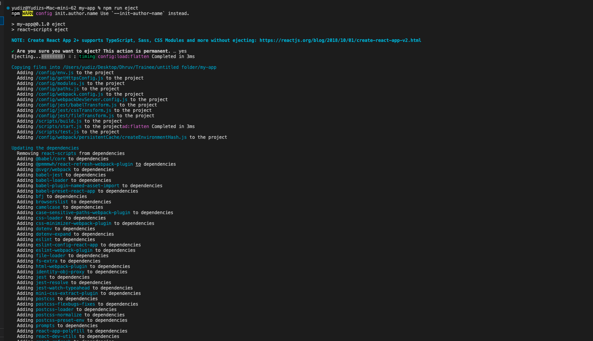
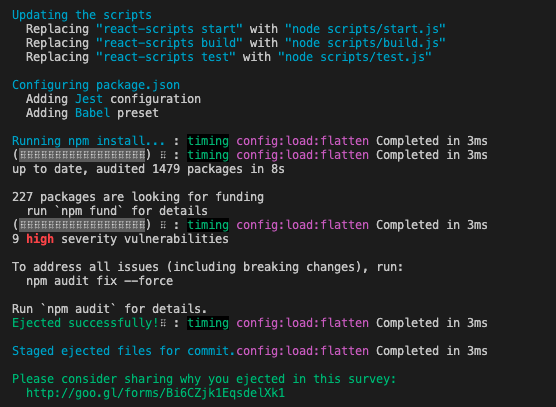
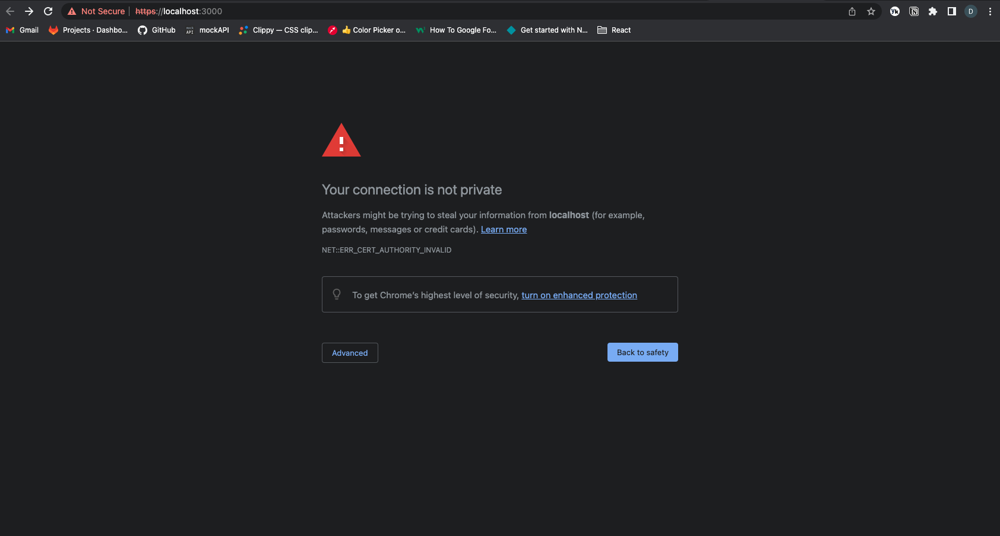

# ReactJS with Dhruv Parmar
It will cover all you need to know in ReactJS.

## What is CRA in React JS ?

CRA stands for Create-react-app through npm or npx. Create-react-app is an official way to create react single page application. [`npx`](https://medium.com/@maybekatz/introducing-npx-an-npm-package-runner-55f7d4bd282b) means Node Package eXecute. And it also provides to build `create-react-app`, in the `npm` versions which are higher than `5.2.+`. 

By creating react app through `npx create-react-app`, there is no need to create config file of [`webpack`](https://webpack.js.org/concepts/#entry) and [`Babel`](https://babeljs.io/docs/en/). It provides the hidden feature of `webpack` and `Babel`, which is installed by `npx` when you run `npx create-react-app my-app` command. `npx` will install all the latest versions of package.

> *I prefer to read the official documentation of [Create-react-app](https://create-react-app.dev/docs/getting-started/).*


### To create your first react app with `npx` :
```javascript
npx create-react-app my-first-app
cd my-first-app
npm start
```

After running the above commands, you will have some files and directory created automatically by it. It will create `node_modules` directory, in which you will find all the packages installed and what's ever that packages will have `dependencies` will be all installed with it. Other files and directories are `src`, [`package.json`](https://docs.npmjs.com/cli/v9/configuring-npm/package-json), `.gitignore`, `public`, and `README.md` file.


## Folder Structure :
After running `npx create-react-app my-first-app`, your folder structure should looks something like this:

```
my-app/
  README.md
  node_modules/
  package.json
  public/
    index.html
    favicon.ico
  src/
    App.css
    App.js
    App.test.js
    index.css
    index.js
    logo.svg
```

Here `public/index.html` is your default page template. If you wanna create your own templates you can [visit here](https://create-react-app.dev/docs/custom-templates) for more info. You will also find `src/index.js` which is your entry point of the app. Only files inside `src` are processed by the webpack. So, we also creates `assets` folder inside it.

## Available Scripts :
After running `npx create-react-app my-first-app` command, you will have few scripts with you to perform it:
1. start
2. test
3. build
4. eject

### 1.  `npm start` :
It is used to run your app in development mode or you can say, it is used to start your packages. If the `scripts` object inside `package.json` doesn't defines a `start` property, npm will run `node server.js` by default.

> *By default it runs on `3000` port of localhost.*


### Whats the difference between `npm run start` and `npm start` ?
---
`npm start` is the short form for `npm run start`.


### 2.  `npm test` :
Launches the test runner in the interactive watch mode.


### 3. `npm run build` :
`npm run build` creates a `build` directory with a production build of your app. It does the same tasks which `npm start` does. Instead of checking for available ports and running a development server, the script will execute `build` function which is available in '**react-srcipts/script/build.js**' which will bundle all your seperate files into one **bundle.js** file. It will ensure, wheather your code is optimized and minified to make better performance.

### 4. `npm run eject` :

> *Note: This is one way operation. If you run `npm run eject` once time, you cannot go back.*

If you aren’t satisfied with the build tool and configuration choices, you can `eject` at any time. This command will remove the single build dependency from your project (react-scripts).

Instead, it will copy all the configuration files and the transitive dependencies (webpack, Babel, ESLint, etc.) into your project as dependencies in `package.json`. All the configuration files from `react-scripts` will be copied into your project roots **react-scripts/config/** folder. And then, the **scritps** to run the build will be copied into the **scripts/** folder.

The dependency will also be moved into your root's `package.json` file. Once you have `ejected` from CRA, you can't undo it. It is mostly used to make your own configuration work on your project.




## Development

### Analyzing Bundle Size

Source map explorer analyzes JavaScript bundles using the source maps. This helps you understand where code bloat is coming from. Analyze and debug JavaScript (or Sass or LESS) code bloat through source maps.

The source map explorer determines which file each byte in your minified code came from. It shows you a treemap visualization to help you debug where all the code is coming from. `.js.map` file is that which is used to debug, and it is present after the build is created '**build/static/js/.js.map**' files.

What's ever the error comes, sometimes we can't get from were it is coming, so here the source map comes in picture. We can get that error through source map files.


> *[Read this blog to understand it in a better way.](https://www.bugsnag.com/blog/source-maps)*


To add `Source map explorer` to your CRA project, run this :
```
npm i --save-dev source-map-explorer
```
Then add `analyze` in `scripts` inside `package.json`:
```javascript
"analyze": "source-map-explorer 'build/static/js/*.js'",
```
Then to analyze the bundle run the below commands:
```
npm run build
npm run analyze
```


## Using HTTPS in Development
By default your app will work on **http://localhost:3000/**, but if you wanna work on **HTTPS**, then follow the steps :

### For Windows : 
Add this to `start` scripts
```javascript
set HTTPS=true&&npm start
```

### For Linux/MacOS :
Add this to `start` scripts
```javascripts
HTTPS=true npm start
```

> *Note that the server will use a self-signed certificate, so your web browser will almost definitely display a warning upon accessing the page.*



### To generate SSL Certificate :
> *[Read this Blog](https://medium.com/swlh/how-to-make-react-js-use-https-in-development-4ead560eff10)*

### So for Custom SSL Certificate
Add this to `start` scripts

```javascript
HTTPS=true SSL_CRT_FILE=cert.crt SSL_KEY_FILE=cert.key npm start
```

## Adding a Stylesheet
- [Official Documentation](https://create-react-app.dev/docs/adding-a-stylesheet)
- [Blog of BEM](https://medium.com/seek-blog/block-element-modifying-your-javascript-components-d7f99fcab52b)
- [Explore What is BEM Methodology by its Official Site](https://en.bem.info/methodology/)

## CSS Module :
CSS Module is a **CSS file** in which all classNames and animation names are scoped locally by default. CSS Modules are convienient for components that are placed in seperate files. The CSS inside a module is available only for the components that imported it. 

### How to create CSS Module file :
Create CSS Module with `.module.css` extension.

For example : create the CSS module file named as `card.module.css`
```javascript
.card {
  width: 300px;
  color: #f3f3f3;
  background-color: #2596be;
  padding: 30px;
  border-radius: 5px;
}

.card-img {
  object-fit: cover;
  width: 300px;
  height: 300px;
}

.card-content {
  background: #f3f3f3;
  color: #666;
  object-fit: cover;
}
```

Now `import` the style module in your component, say for example, I have shopping cart website, now I need this style in my `card` component:

> *Card.js*
```javascript
import styles from './card.module.css'

const Card = () => {
  return <div className={styles.card}>
            
            <div className={styles.card-content}>
              <h1>Title</h1>
            </div>
         </div>
}

export default Card;
```
